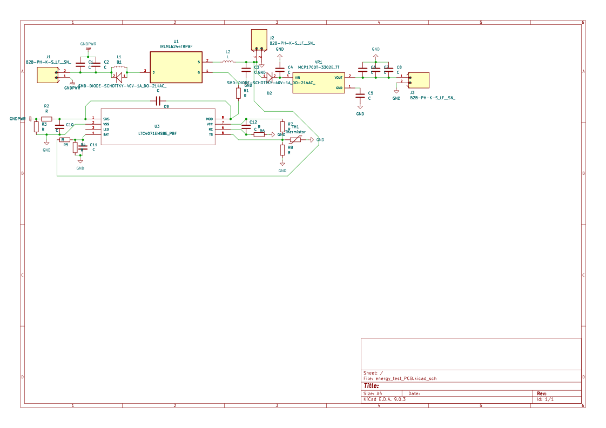
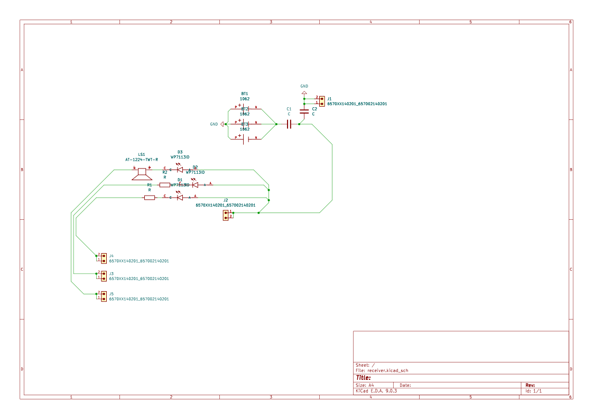
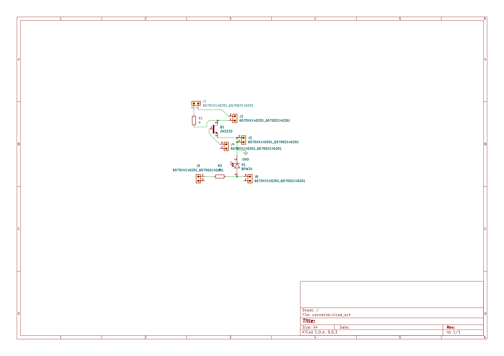
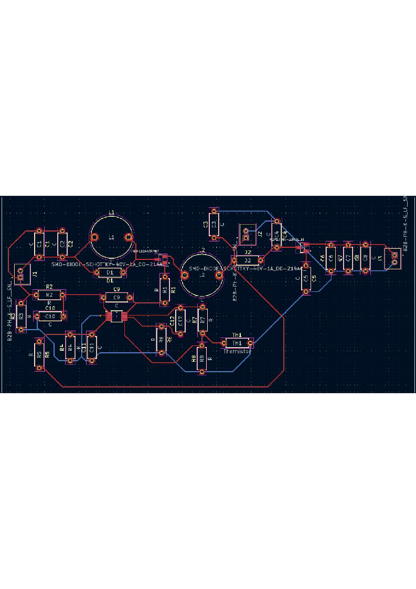
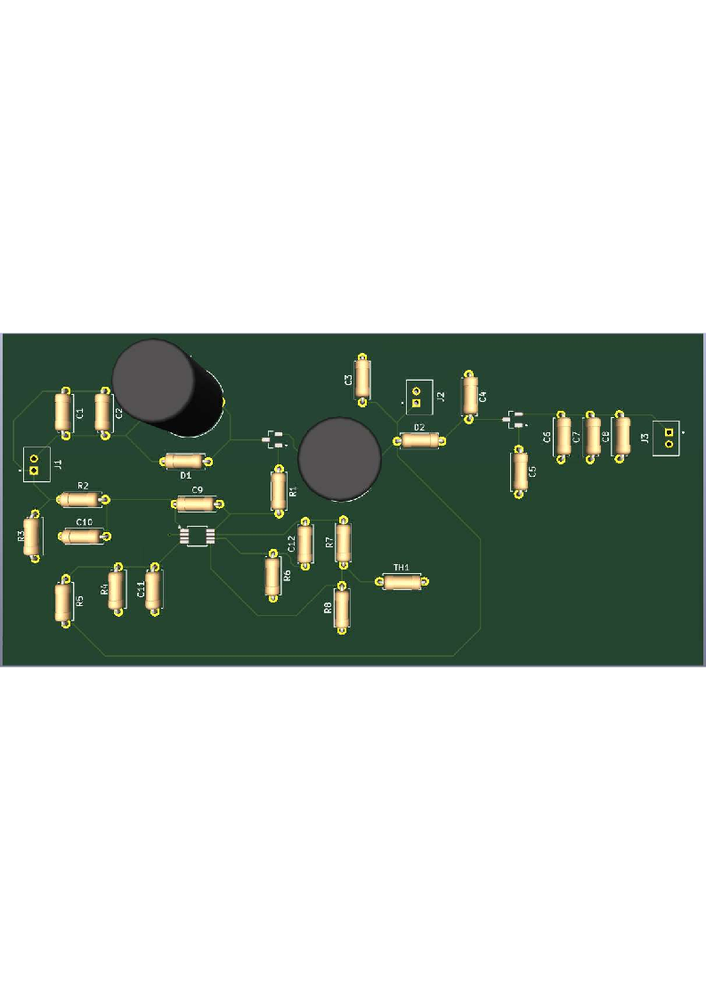
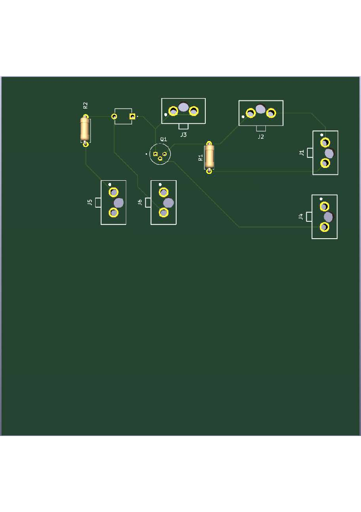
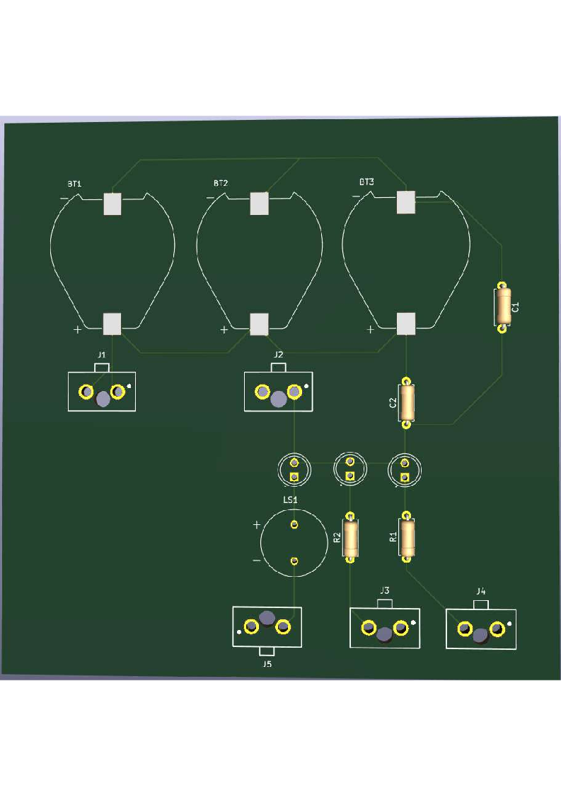

# smartChicken: Multi-Sensor Environmental & Security System

A lightweight, event-driven application built on **Zephyr RTOS** for multi-sensor data collection and Bluetooth Low Energy (BLE) alert broadcasting.

## Project Structure
* **`soft_nRF`**: Core sensor hub firmware utilizing cooperative and preemptive workqueues to schedule non-blocking sensor sampling and manage UART/PWM peripherals.
* **`soft_nRF_R`**: Standalone receiver node logic that scans for specific broadcasting frames and drives physical LED indicators based on alert states.
* **`PCBs`**: Design files for 3 custom boards handling solar power adaptation, battery storage, and 3.3V/5V regulated power delivery.
* **`3D_prints`**: Mechanical manufacturing models, including a structural base support for a 24-cell PV solar panel.

---

  
 Power supply layout 

  
  

  
 Receptor board layout 

  
  

  
 Connector board layout 

  
  

  
 Power supply routes 

  
  

  
 Power supply 3D board 

  
  

  
 Connector 3D board 

  
  

  
 Receptor 3D board 

  
  

## Technical Specifications

### 1. Concurrency Contexts (`main.c`)
The system offloads tasks to Zephyr's workqueue framework to avoid continuous thread shifting:
*   **`sensor_wq`**: Cooperative workqueue (Stack: 1024, Priority: 5) dedicated to regular, periodic sensor sampling routines.
*   **`critical_wq`**: Preemptive workqueue (Stack: 1024, Priority: -4) reserved for immediate actuator responses.

### 2. Peripheral & Sensor Matrix
*   **SCD30**: Interfaced via I2C (`DT_NODELABEL(scd30)`). It measures CO2, temperature, and humidity. Integrity is verified through a Sensirion-compliant polynomial `0x31` CRC-8 check.
*   **DHT11**: Connected via GPIO (`gpio0`, pin 4). Measures environmental metrics every 5000 ms using single-wire signaling.
*   **PIR Sensor**: Connected via GPIO (`gpio1`, pin 8). Polled asynchronously every 2500 ms to capture motion vectors.
*   **Photodiode**: Monitors ambient light variations.
*   **Fan Actuator**: Driven by hardware PWM (`DT_ALIAS(pwm_led0)`) with a baseline period of 40 µs.
*   **UART Host Link**: Mapped to `uart20` (RX: P1.05, TX: P1.04). Operates with a 4-byte receive buffer and a 1000 µs window timeout for ESP32 communications.

### 3. Thresholds & Control Hysteresis
*   **CO2 Threshold**: Registers an alert state if carbon dioxide levels exceed 1000.0 ppm.
*   **Fan & Thermal Management (`DHT11.c`)**:
    *   Turns **ON** (100% duty cycle) if Temperature > 23°C (`FAN_THRESHOLD_TEMP_SUP`).
    *   Turns **OFF** (0% duty cycle) when Temperature drops below 23°C.

### 4. Custom BLE Alert Protocol
The transmitting hub identifies itself as `"smartChicken"`. Discovered alerts modify a 1-byte payload packaged within a Custom Manufacturer Data sequence using Company ID `0x0D06`:

| Bit Index | Packet Macro Flag | Trigger Condition |
| :--- | :--- | :--- |
| **Bit 0** | `BLE_PAQUET_TEMP_BIT` | Temperature exceeds 23°C |
| **Bit 1** | `BLE_PAQUET_GAS_BIT` | SCD30 calculated CO2 exceeds 1000.0 ppm |
| **Bit 2** | `BLE_PAQUET_ATTACK_BIT` | Motion registered by the PIR sensor line |

The receiver application (`soft_nRF_R`) scans for this explicit frame, decodes the bit field state, and directly alters the status of `led0`, `led1`, and `led2`.

